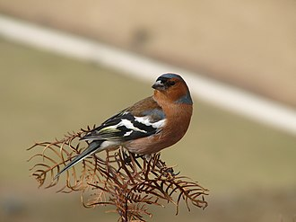

<!-- use control + shift + c to create a comment like this -->
<!-- keep this default set up code chunk -->

<!-- use control + alt + i to create a code chunk -->
```{r setup, include=FALSE}
knitr::opts_chunk$set(echo = F,
                      warning = F,
                      message = F,
                      fig.retina = 3)
```

# **Introduction** 
Example of a reference on a Chaffinch based paper [@Jobling] 


(ref:chaff-fig) <- A male Chaffinch. By Photo Gidget Tinker Warrior, 2007, https://en.wikipedia.org/wiki/Common_chaffinch#/media/File:Male_Chaffinch,_species_introduced_to_New_Zealand_in_the_1860's.jpg}

Image
[@Gidget]
<!-- This adds an image onto the HTML output -->
```{r weddell-fig, out.height="200px", fig.cap='(ref:chaff-fig)'}

```

## *This is the introduction section which gives background on the project* 

# **Methods**
## *This is the methods section that tells you how we did what we did* 

# **Results** 

# **Discussion** 

```{r read in data}
chaff <- read.table("chaff (1).txt", header = T)
```

<!-- update the tidyverse package -->
```{r packages}
library('tidyverse')
chaff_tidy <- chaff %>%
  pivot_longer(names_to = "sex",
               values_to = "mass",
               cols = everything())
```

<!-- adding a code chunk to calculate SS(x) of all the mass values -->
```{r sum_sq(chaff_mass)}
sum_sq <- function(chaff_tidy) {
  sum((chaff_tidy - mean(chaff_tidy))^2)
}

```

<!-- two variables defined within the function 
created a dataframe with the column measure in it
measure is a generic -->
```{r column function}
sum_sq <- function(df, measure) {
  df %>% summarise(ss = sum(({{measure}} - mean({{measure}}))^2))
}
sum_sq(chaff_tidy, mass)

# adapt the function to calculate the SS(x) for each sex
# here measure and group are standard and then you can plug in the specific variables
sum_sq <- function(df, measure, group) {
  df %>% group_by({{ group }}) %>% 
    summarise(ss = sum(({{measure}} - mean({{measure}}))^2))
}

sum_sq(chaff_tidy, mass, sex)
```

<!-- here we are calculating the summary data - mean/ sd/ se etc 
creates a new table with the results in
this is not using a function though! this is pipeline-->
```{r summary data}
chaff_summary <- chaff_tidy %>% 
  group_by(sex) %>% 
  summarise(n = length(mass),
            mean = mean(mass),
            sd = sd(mass),
            se = sd/sqrt(n))
```
<!-- creating a function which will calculate the summary stats for the data 
remember to add ALL the types of brackets () and {} -->
```{r data_summary}
data_summary <- function(df, measure, group) {
  df %>% group_by({{ group }}) %>% 
    summarise(mean = mean(({{measure}})),
              sd = sd(({{measure}})),
              n = n(({{measure}})),
              se = se(({{measure}})))
}
```

```{r}
t.test(data = chaff_tidy,
       mass ~ sex,
       var.equal = T)
```

